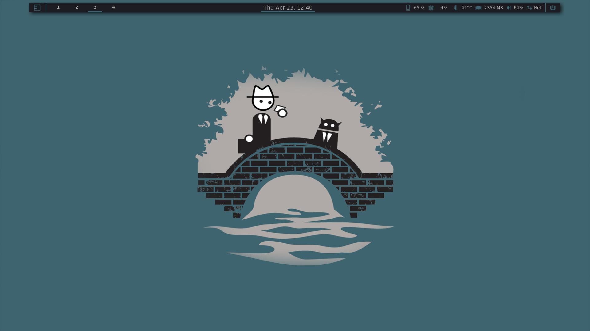

# Personal Theme Collection

## Dependencies

- awesome (>= 4.3)
- betterlockscreen
- rofi
- compton
- Fira Code Font

## Project organization

```sh
├── .config                 # Home directory config files
├── bindings                # Client and Global bindings (key and mouse)
├── freedesktop             # Dependency
├── lain                    # Dependency
├── modules                 # Complex widgets
├── rules                   # Rules definitions
├── signals                 # Global signals
├── themes                  # Themes folders
├── wdgpack                 # Widget utilities
├── apps.lua                # Apps definitions
├── autostart.lua           # Autostart applications
├── debugger.lua            # Debugging utilities
├── handlers.lua            # Debug error handlers
├── menu.lua                # Freedesktop menu definition
├── mytable.lua             # Table compatibility
├── rc.lua                  # Main entry point
```

## Showcase

### Minimal

_Inspired by minimal theme from i3_


